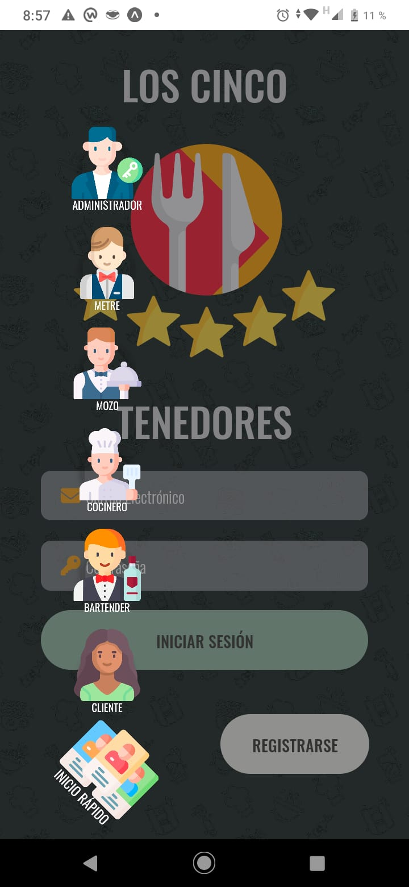

# Trabajo práctico grupal - PPS - segundo parcial

#### LOOK AND FEEL

<table>
  <tr>
    <td>ICONO</td>
     <td>PALETA DE COLORES</td>
  </tr>
  <tr>
    <td></td>
     <td></td>
  </tr>
</table>

#### SCREENSHOTS

#### SPLASH

#### PANTALLA DE INICIO E INICIO RAPIDO

 

#### EJEMPLO DE PANEL DE USUARIO

#### EJEMPLO DE ALTA

## CINCO TENEDORES APP - SEMANA 1 (21/05 AL 27/05):
| # | Tarea | Responsable | Estado | Rama |
| :------: | :------: | :------: | :------: | :------: |
| - | Generacion de proyeto | GONZALO |  Terminado | Rama main |
| - | Iconos + Splash | CECILIA | Terminado | Rama main |
| - | Login | PEDRO | Terminado | Rama main |
| - | Registro | GONZALO | Terminado | Rama main |

## CINCO TENEDORES APP - SEMANA 1 (28/05 AL 03/06):
| # | Tarea | Responsable | Estado | Rama |
| :------: | :------: | :------: | :------: | :------: |
| 01 | Alta de dueño / supervisor | GONZALO  | Terminado | Rama altaDueño |
| 02 | Alta de empleados | CECILIA  | Terminado | Rama altaEmpleado |
| 03 | Alta de clientes | GONZALO | Terminado | Rama altaCliente |
| 04 | Alta de Mesa | PEDRO | Terminado | Rama altaMesa |
| 05 | Alta de Productos | PEDRO | En Proceso | Rama altaProducto |
| 12 | Agregar un nuevo cliente registrado  | GONZALO | Terminado | Rama altaCliente |
| 17 | Agregar cliente nuevo | GONZALO | En Proceso | Rama altaClientePush |

## CINCO TENEDORES APP - SEMANA 1 (04/06 AL 10/06):
| # | Tarea | Responsable | Estado | Rama |
| :------: | :------: | :------: | :------: | :------: |

## CINCO TENEDORES APP - SEMANA 1 (11/06 AL 17/06):
| # | Tarea | Responsable | Estado | Rama |
| :------: | :------: | :------: | :------: | :------: |

## CINCO TENEDORES APP - SEMANA 1 (18/06 AL 24/06):
| # | Tarea | Responsable | Estado | Rama |
| :------: | :------: | :------: | :------: | :------: |

## CINCO TENEDORES APP - DISTRIBUCION DE TAREAS:

| # | Tarea | Responsable | Estado | Rama |
| :------: | :------: | :------: | :------: | :------: |
| - | Generacion de proyeto | GONZALO |  Terminado | Rama main |
| - | Iconos + Splash | CECILIA | Terminado | Rama main |
| - | Login | PEDRO | Terminado | Rama main |
| - | Registro | GONZALO | Terminado | Rama main |
| ALTAS                      
| 01 | Alta de dueño / supervisor | GONZALO  | Terminado | Rama altaDueño |
| 02 | Alta de empleados | CECILIA  | En proceso | Rama altaEmpleado |
| 03 | Alta de clientes | GONZALO | Terminado | Rama altaCliente |
| 04 | Alta de Mesa | PEDRO | En Proceso | Rama altaMesa |
| 05 | Alta de Productos | PEDRO | En Proceso | Rama altaProducto |
| CODIGOS QR                      
| 06 | Qr ingreso al local | PEDRO | - | Rama qrIngreso | 
| 07 | Qr de la mesa | GONZALO | - | Rama qrMesa |
| 08 | Qr de propina  | CECILIA | - | Rama qrPropina |
| ENCUESTAS                     
| 09 | Encuesta cliente | CECILIA | - | Rama encuestaClientes |
| 10 | Encuesta Empleado | PEDRO | - | Rama encuestaEmpleado |
| 11 | Encuesta supervisor | GONZALO | - | Rama encuestaSupervisor |
| GESTION 
| 12 | Agregar un nuevo cliente registrado  | GONZALO | Terminado | Rama altaCliente |
| 13 | Ingresar al local | GONZALO | - | Rama ingresoLocal |
| 14 | Realizar pedidos | PEDRO | - | Rama altaPedido | 
| 15 | Confirmar pedidos | CECILIA | - | Rama confirmacionPedido | 
| 16 | Generar reservas agendadas | PEDRO | - | Rama reservas |
| PUSH NOTIFICATION
| 17 | Agregar cliente nuevo | GONZALO | En Proceso | Rama altaClientePush |
| 18 | Ingresó al local | CECILIA | - | Rama ingresoLocalPush |
| 19 | Consultar al mozo | CECILIA | - | Rama consultaMozoPush |
| 20 | Confirmar pedido (mozo) | PEDRO | - | Rama confirmacionPedidoPush |
| 21 | Confirmar pedido (bar/cocina) | PEDRO | - | Rama confirmacionPedidoPush |
| 22 | Generar reservas agendadas / Delivery | GONZALO | - | Rama reservaPush |
| DELIVERY
| 23 | Realizar pedido con GPS o dirección | CECILIA / PEDRO | - | Rama altaPedido |
| 24 | Mapa de ruta hasta el domicilio de entrega | GONZALO | - | Rama rutaPedido |
| JUEGOS
| 25 | Juego para un 10% de descuento | GONZALO | - | Rama juego10 |
| 26 | Juego para un 15% de descuento | CECILIA | - | Rama juego15 |
| 27 | Juego para un 20% de descuento | PEDRO | - | Rama juego20 |
