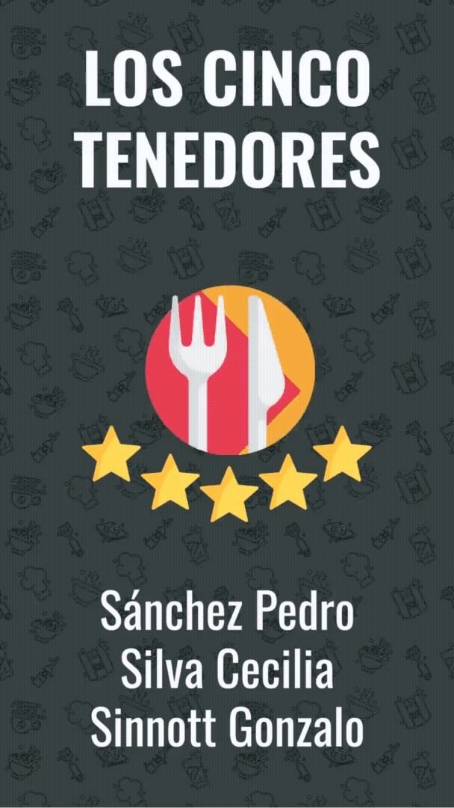

# 2022_TP_PPS_Comanda_1_cuatri
Trabajo práctico grupal - PPS - segundo parcial

[ROAD MAP TENTATIVO](https://github.com/gonzalosinnott/2022_TP_PPS_Comanda_1_cuatri/blob/main/Documentos/ROAD%20MAP%20CINCO%20TENEDORES%20APP%20.pdf)

[LOOK AND FEEL](https://github.com/gonzalosinnott/2022_TP_PPS_Comanda_1_cuatri/blob/main/Documentos/LOOK%20AND%20FEEL%20CINCO%20TENEDORES%20APP%20.pdf)

<table>
  <tr>
    <td>ICONO</td>
     <td>PALETA DE COLORES</td>
  </tr>
  <tr>
    <td></td>
     <td></td>
  </tr>
</table>

#### SCREENSHOTS

#### SPLASH

#### PANTALLA DE INICIO E INICIO RAPIDO

 

#### EJEMPLO DE PANEL DE USUARIO

## CINCO TENEDORES APP - TAREAS ( ACTUALIZADO AL 27/05):

### SPLASH E INICIO (INCLUYE INICIO RAPIDO): TERMINADO

#### Altas 
A- Alta de dueño / supervisor  (Branch: altaDueño) GONZALO - EN PROCESO

B- Alta de empleados (Branch: altaEmpleado) GONZALO - EN PROCESO

C- Alta de clientes (Branch: altaCliente) CECILIA - EN PROCESO

D- Alta de Mesa (Branch: altaMesa) PEDRO - EN PROCESO

E- Alta de productos (Branch: altaProducto) CECILIA / PEDRO - EN PROCESO

#### Códigos QR 
E- QR de ingreso al local: (Branch: qrIngreso) PEDRO - EN PROCESO

F- QR de la mesa (Branch: qrMesa) GONZALO - EN PROCESO

G- QR de propina (Branch: qrPropina) CECILIA - EN PROCESO
